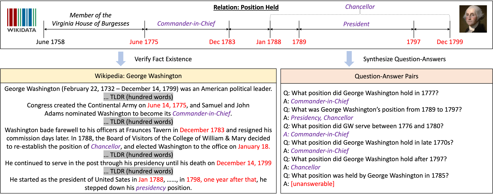

# Time-Sensitive-QA
The repo contains the dataset and code for paper [Time-Sensitive Question Answering dataset](https://arxiv.org/abs/2108.06314). The dataset is collected by UCSB NLP group and issued under MIT license.

.

## Repo Structure
- dataset/: this folder contains all the dataset
- dataset/annotated*: these files are the annotated (passage, time-evolving facts) by crowd-workers.
- dataset/train-dev-test: these files are synthesized using templates, including both easy and hard versions.
- BigBird/: all the running code for BigBird models
- FiD/: all the running code for fusion-in-decoder models

## Requirements
- [hydra 1.0.6](https://hydra.cc/docs/intro/)
- [omegaconf 2.1.0](https://github.com/omry/omegaconf)
### BigBird
- [Transformers 4.8.2](https://github.com/huggingface/transformers)
- [Pytorch 1.8.1+cu102](https://pytorch.org/)
### FiD
- [Transformers 3.0.2](https://github.com/huggingface/transformers)
- [Pytorch 1.6.0](https://pytorch.org/)

## BigBird

Extractive QA baseline model, first switch to the BigBird Conda environment:

### Initialize from TriviaQA checkpoint
1. Running Training
```
    python -m BigBird.main model_id=triviaqa cuda=[DEVICE] mode=train per_gpu_train_batch_size=2
```

2. Running Evaluation (Hard)
```
    python -m BigBird.main model_id=triviaqa dataset=hard mode=eval cuda=[DEVICE] model_path=[YOUR_MODEL]
```

### Initialize from NQ checkpoint
1. Running Training
```
    python -m BigBird.main model_id=nq cuda=[DEVICE] mode=train per_gpu_train_batch_size=8
```

1. Running Evaluation (Hard)
```
    python -m BigBird.main model_id=nq dataset=hard cuda=[DEVICE] mode=eval model_path=[YOUR_MODEL]
```


## Fusion-in Decoder

### Initialize from NQ checkpoint
1. Running Training
```
    python -m FiD.main mode=train model_path=/data2/wenhu/Time-Sensitive-QA/FiD/pretrained_models/nq_reader_base/ dataset=hard
```

2. Running Evaluation (Hard)
```
    python -m FiD.main mode=eval cuda=3 dataset=hard model_path=[YOUR_MODEL] 
```
